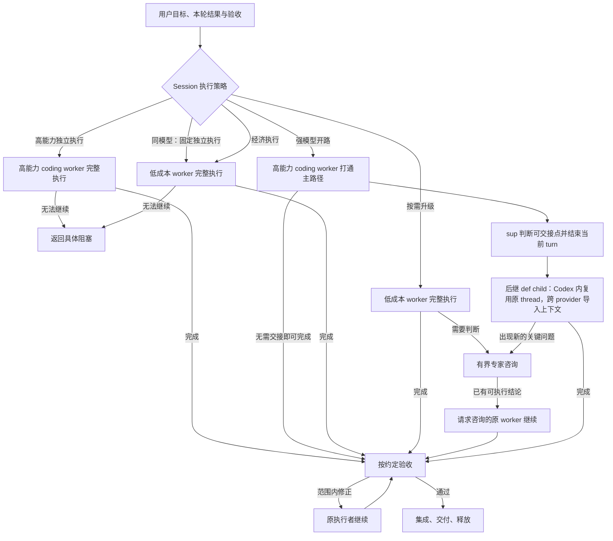

# Workflow 流程管理升级方案

> 当前用户需求：[plugin-requirements.md](../plugin-requirements.md)。
> 本文保留升级演变；策略与交接行为是需求来源，旧 core/权限/事件通道方案及“尚未实现”快照不再作为当前实施指令。

日期：2026-09-14。

状态：阶段设计记录；文中目标行为不代表当前验证结果。选定接续方案为“后继 DSH child＋保留 Codex thread”，替代早先要求 DSH Session／worker 不变的方案；当前工作按上方统一入口执行。

## 1. 目标

在完成相同用户目标和验收要求的前提下，降低一次任务的实际总费用，尤其是高能力模型反复读取文件、修改代码、编写测试、读取日志，以及携带长上下文重复请求的费用。

低成本模型可以独立调查、实现、测试、调试和调整实施方案。是否需要高能力模型，应由当前任务的知识缺口、不确定性和实际执行证据决定，不能仅凭模型价格或角色名称判断。

高能力模型可以进行有界规划、设计判断、困难实现或审核。在混合执行策略中，解决关键不确定性后可以退出常规执行循环；选择高能力独立执行时，则由其完成整个任务。

本轮升级集中于流程管理。已经实现的 subagent 身份、角色和模型配置继续作为执行基础。

## 2. 已确认原则

1. **原始目标持续有效。** 合同、实现和局部审核全部通过，不自动代表用户目标完成。技术困难应作为具体能力缺口处理，不能静默缩减要求。
2. **同一目标一次交付完整已知任务。** 强耦合步骤由同一执行者连续推进；不同独立目标使用各自上下文。不把已知下一步骤反复作为 followup 派发。
3. **执行者可以调整实施方法。** Planner 冻结目标、边界和验收，不预先规定全部实现步骤与 checkpoint。改变用户行为、权限或约定范围时才进入相应修订。
4. **快速演化优先主框架和主路径。** 用户希望尽快看到效果时，集中资源形成可体验结果；非常见问题按实际反馈处理。必要安全与数据完整性保障仍需保留。
5. **低成本模型承担完整工作段。** 普通失败、测试和范围内修复由其自行完成，避免每个动作都回到高能力模型。
6. **模型不重复插件已有机械检查。** 复用身份、依赖、写入范围、候选、集成及释放约束。
7. **以全任务成本评价分工。** 同时计入规划、worker、咨询、审查、缓存读写、重试与返工；不能仅比较模型单价或缓存命中率。
8. **流程复杂度由证据驱动。** 不默认启用长期结对审视、逐步骤审批、多角色全流程或必填复盘。

历史依据：[DSH 拆分用量统计与多 Agent 工作方式复盘](docs/split-token-retrospective-2026-09-11.md)。

## 3. 当前实现基础

| 能力 | 当前落点 | 升级中的处理 |
| --- | --- | --- |
| Profile 与角色执行配置 | `src/configuration.ts`、`src/roles.ts`、`profiles/` | Profile 设置保留 sup／def 两套 coding 配置；执行角色统一为 `coding_worker` |
| Session 级 Profile 选择 | `src/store.ts`、`src/profile-rpc.ts`、`src/client/ConfigPicker.tsx` | 在现有入口旁增加执行策略选择 |
| 原生 child 创建与续接 | `src/workers.ts` | 复用身份与边界；记录策略内的执行配置切换 |
| 合同与结果校验 | `scripts/workflowctl.py` | 复用 Goal、Acceptance、Constraints、Validation、Return when |
| 派发、审核、集成和释放 | `src/workflow.ts`、`src/host.ts` | 保留现有约束，补充策略绑定和问题处理路线 |
| 执行状态及报告 | provider 的 `codexExecution.read()` | 执行事实继续由原生执行层提供 |

当前限制：

- `record-result` 将 `blocked`、`needs-decision`、`needs-verification` 都归入 attempt 的 `blocked` 状态，状态摘要尚未保留这些不同处理含义。
- `continue` 续接原 worker，不更换其模型；切换 Profile 只影响未来创建的 child。
- 同一 attempt 当前只有一个主 worker；仍占用的 lane 和写入范围不能直接交给另一个 worker。
- provider 内部已有用量处理，但公开的 `NativeExecution` 投影没有用量字段；workflow 尚不能据此完整归因任务费用。
- `docs/architecture.md`、`docs/HANDOFF.md`、`docs/NEXT-STEPS.md` 含不同阶段的旧边界。实施时需明确当前文档入口及历史文档状态，避免据旧约定恢复完整 worker UI 或错误删除现有配置 UI。

## 4. Coding 与 Integrate 独立策略设置

在 **设置 → 工作流** 增加 **策略** tab，与现有模型配置分开；分别设置 **Coding 策略** 和 **Integrate 策略**，独立保存，互不覆盖。Coding 的默认值保持 `adaptive`；Integrate 的默认值为 `economy`，即 **def 独立执行**，不自动升级。

输入面板保留 **Coding 策略** dropdown，位于 Profile 选择旁，用于当前父 Session 的 coding 选择；Integrate 策略在设置页修改，不增加输入面板控件。当前 Profile 的 sup、def 使用同一模型时，隐藏输入面板的 Coding 策略控件，两类工作的有效策略均固定为 def 独立执行。设置页保留两项偏好，并明确显示同模型下的实际执行方式。

默认设计：同模型判断使用解析后的 provider 与 model 标识，不因 effort 不同而显示策略选择。同模型时统一使用 def 配置及独立执行 prompt，不触发 sup／def 升级、降档或交接；这是配置推导出的固定行为，不是第五个可选模式。

| 显示名称 | 建议内部值 | 执行规则 | 适用情况 |
| --- | --- | --- | --- |
| 经济执行 | `economy` | 低成本 worker 独立完成；无法解决时返回具体阻塞，不自动调用高能力模型 | 目标明确、已有成熟实现模式 |
| 按需升级 | `adaptive` | 低成本 worker 连续执行；遇到具体知识或判断缺口时进行有界专家咨询，再由原 worker 继续 | 默认选项，适合多数开发任务 |
| 强模型开路 | `bootstrap` | `coding_worker` 先使用 Profile 的 sup 配置，自行判断交接点，再使用 def 配置接续完成 | 核心接入或方案尚未成立 |
| 高能力独立执行 | `expert` | `coding_worker` 使用 Profile 的 sup 配置独立完成调查、实现、测试和修复，不自动降档 | 希望高能力模型持续负责整个任务 |

四种模式表达调用顺序和升级策略，不是权限等级，也不承诺费用按名称严格排序。快速演化或正式交付的诉求记录在本轮目标中，四种策略都应遵守。

### 4.1 与 Profile 的关系

- **Profile 设置层**保留 sup、def 两套 coding 配置，各自设置 provider、model、effort。现有 `sup_coding_worker`、`def_coding_worker` 配置入口可继续承载这两套设置，不再据此区分执行角色。
- **执行层**统一使用 `coding_worker`，负责调查、实现、测试与范围内修复。合同中的 Role、目标和权限不随 sup／def 配置切换而变化；DSH child 可以更换，前后身份由交接记录关联。
- **执行策略**决定选用哪套配置、是否交接、何时交接，以及初始和接续 prompt。Profile 提供配置并决定是否存在模型选择空间，不为四种策略复制四份 Profile。
- 通用 coding prompt 定义持续有效的责任；策略及阶段 prompt 描述当前工作方式。开路阶段的交接要求不固化进整个线程的长期指令。
- `planner`、`reviewer` 等其他角色保持各自责任；需要写产品代码时使用 `coding_worker`。

| 策略 | Profile 配置使用方式 | 执行 prompt 的关键约定 |
| --- | --- | --- |
| `economy` | def 全程 | 独立完成，具体阻塞时返回，不自动升级 |
| `adaptive` | def 主执行，按需高能力咨询 | 普通纠错自行完成，具体问题请求帮助，获得结论后继续 |
| `bootstrap` | sup → def | sup 阶段自行判断交接点，def 阶段从当前状态完成剩余任务 |
| `expert` | sup 全程 | 独立完成全部工作，不主动降档交接 |

### 4.2 选择、派发和切换

- 工作流设置保存独立的 coding 默认策略与 integrate 策略。每个原生父 Session 独立保存输入面板明确选择的 coding 覆盖值；未覆盖时使用设置中的 coding 默认值，设置缺省则为 `adaptive`。Integrate 从设置读取自己的策略，缺省为 `economy`，不继承 coding 覆盖值。两者同模型时有效策略始终为 def 独立执行。
- 老 Session 尚无策略字段时，按同样规则推导有效策略。已有 attempt 不追溯赋予自动升级权限。
- 切换 Profile 后重新计算控件可见性和新派发的有效策略。同模型期间保留原策略偏好，但不执行它；回到不同模型的 Profile 时恢复该偏好，无 coding 覆盖值则使用设置中的 coding 默认值。
- Host 与 UI 使用相同的有效策略规则，不能仅隐藏 dropdown 而继续按历史偏好触发交接。
- UI 选择经现有认证的 `/workflow` 通道提交，由 Host 保存；客户端不直接修改编排状态。
- 派发时保存策略及 Profile 中 sup／def 配置的快照，并使合同的角色、升级约定及后续阶段与该快照一致。
- 切换选择影响尚未派发的新执行单元；已运行任务、其后续咨询，以及已经绑定的开路／扩展阶段沿用原策略。
- 对已冻结但与新选择冲突的任务，先完成相关合同修订，不能仅替换模型或忽略合同中的 Role。
- 改变运行中任务的策略必须显式更新相关约定；已绑定 `bootstrap` 的 sup → def 切换属于策略内执行，无需修改角色或重新审批合同。

通过本插件派发的普通 `coding_worker` 也使用父 Session 的 coding 策略，但不因此进入 managed workflow 的合同、审核、集成和 lane 分配流程。Managed 集成阶段按第 4.3 节使用独立的 integrate 策略；其他普通角色及绕过本插件的原生委派不受此策略自动接管。

### 4.3 Integrate 策略与作用范围

Integrate 策略控制集成阶段需要模型参与的工作，独立于产生任务候选的 coding 策略。默认 `economy` 使用 Profile 的 def 配置完成集成工作，不能因 coding 使用 `expert` 或 `bootstrap` 自动改用 sup。无需模型判断的 Git 操作仍由 Host 执行，不为套用策略新增模型调用。

设置页两项策略共用 `economy`、`adaptive`、`bootstrap`、`expert` 四种选项及第 4 节的模型选择规则，但分别保存为默认项。Integrate 没有 Session 配置，直接使用面板中的 integrate 默认项。这里复用 Profile 的 sup／def 模型配置，不新增一套 integrate 模型配置。策略改变配置和升级路线，不改变角色权限：集成审核仍由独立的 `reviewer` 负责，必要的冲突修复由有明确写入范围的 `coding_worker` 负责；修复者不能验收自己的候选。普通任务审核仍沿用原 reviewer 配置，不被 integrate 设置接管。

第一次准备新的 integration 时绑定 integrate 策略及 Profile 快照，其审核、修复、咨询和续接沿用该绑定，并分别保留各自的角色与责任。仅切换模型不将 reviewer 变成 coding_worker。集成适用的控制报告还需绑定 integration、target 与 candidate；只按各角色已授权的阶段路由，不直接套入允许写产品代码的 coding 提示。

设置变更影响尚未开始的集成；已绑定的集成及后续修复不被改写。目标变化需刷新集成时，先保留旧集成及证据，再为新集成绑定当时的设置。已有历史集成记录沿用旧绑定，不追溯推导新策略。

### 4.4 设置与输入面板的文案

| 位置 | 文案 | 作用 |
| --- | --- | --- |
| 设置 → 工作流 → 策略 | Coding 默认策略 | 新 coding 执行的默认策略；当前会话可在输入面板覆盖 |
| 设置 → 工作流 → 策略 | Integrate 默认策略 | 集成直接使用此配置，无 Session 覆盖；默认 def 独立执行 |
| 输入面板 | Coding 策略 | 仅覆盖当前会话的 coding 策略，不修改 Integrate 策略 |

设置、Session 覆盖值与派发快照分别保存。策略 tab 的设置适用于工作流，不复制四份 Profile；Profile 继续提供模型配置。设置保存与输入面板选择均通过已认证的 Host 通道，使用一致的有效策略与可用性规则。未覆盖的 Session 在下一次派发时读取最新 coding 默认值；已有覆盖值保持不变。

## 5. 参考执行流程

下图描述 coding 执行；候选验收后，集成中的模型工作另外使用第 4.3 节的 integrate 策略。



### 5.1 目标与任务准备

复用 `plan.md` 和任务合同，明确：

- 原始用户目标，以及本轮结果如何推进该目标。
- 本轮交付诉求：快速验证方向，或满足明确交付要求。
- 可观察的验收对象和行为。
- 输入、写入范围、资源、依赖及实际完成条件。
- 执行者可以自行调整的内容，以及必须返回的问题。

任务准备不必调用高能力 Planner。目标和现有模式已清楚时，由负责人生成足够执行的合同即可。

### 5.2 连续执行

一次派发包含完整已知任务，worker 自行完成调查、实施、测试和普通纠错。可批量完成的工具操作尽量批量完成，原始日志放在 artifacts，仅将必要结果和失败定位带入后续模型上下文。

完成、具体阻塞或约定的决策需求通过现有报告交付。父代理不逐命令跟进；运行等待和完成通知复用原生生命周期，不用模型持续轮询。

### 5.3 按需升级

升级依据是当前问题，不是简单的失败次数或已经消耗的 token 数。

| 情况 | 路线 |
| --- | --- |
| 普通编译、测试、配置错误，仍有合理修复步骤 | 原 worker 自行修复 |
| 缺少可检索的代码或文档事实 | 原 worker 按需读取；确有独立调查价值时再委派 |
| 环境、权限或资源不足 | 处理具体资源问题，不自动升级模型 |
| 方案选择影响用户行为、核心边界或大量后续工作 | 请求有界专家判断 |
| 已有尝试暴露理解缺口，无法提出有依据的下一步 | 携带失败证据请求诊断 |
| 必须改变用户目标、验收或授权范围 | 交由目标负责人处理，必要时向用户澄清 |

咨询材料包含原始目标、本次问题、当前选择、相关代码／失败证据，以及需要决定的事项。专家返回结论、依据和必要示例或建议补丁，原 worker 应用并验证。

第一版咨询默认不修改原 worker 的工作区；证据应绑定稳定候选或明确的文件快照。专家需要直接写代码时，应转成明确的 coding assignment 并处理原任务写入占用，不能两者并发修改同一 lane。

已有咨询未完成时复用其身份，避免同一问题重复派发。咨询无法解决时保留具体阻塞，不循环创建更多专家。结果过期或原任务已修订时，不自动将旧结论作为继续执行的依据。

### 5.4 强模型开路

开路 `coding_worker` 使用 Profile 的 sup 配置推进完整任务，根据实际代码和剩余不确定性判断可交接点。Planner 不预设细粒度 checkpoint，也不要求先完成整个框架。

主路径或关键难点足够明确、剩余工作适合 def 连续推进时，简短报告已完成内容、关键决定、验证事实和剩余工作，并结束当前 turn。不为了交接重新读取全部文件或单独执行一轮验收；若接近完成，可以直接完成。

同一个 Codex provider 内，使用 **后继 DSH child 接续原 Codex thread**：

1. sup child 返回 handoff 并结束 turn；确认旧执行和写入命令停止。
2. Host 预留同一父 Session 下的 def child ID，通过 provider 交接原 thread 的执行占用，保留旧记录和报告。
3. 新 child 创建时直接使用 Profile 快照中的 def provider／model／effort。provider 将其绑定到原 thread，以目标执行配置调用 `thread/resume`，随后在该 thread 上发起接续 `turn/start`。
4. Codex thread、task/attempt、合同、lane 与产品写入边界不变；DSH child Session／worker ID 改变。新 turn 确认后，新 child 成为本任务的当前执行者。

接续 prompt 示例：

> 你是本任务的后继 coding_worker，现使用 def 配置。原 Codex thread 已由 Host 接续；沿用原始目标、约束、验收和该线程已有上下文，完成剩余实现、测试与范围内修复。此前开路阶段的交接要求已完成，不再交接。以下是已完成事实和剩余工作……

不要求变更运行中 DSH Agent 的模型配置，不依赖新增 DSH core route-update 接口。不用 `thread/fork`，也不通过新建 Codex thread 后仅导入摘要替代原线程。缓存命中与跨模型缓存复用不作保证，验收以原线程身份、可用上下文及正确结果为准。

### 5.5 Codex 与 provider 实现依据

本地 Codex 源码为 `79b4f03d3`、CLI 为 `0.154.0`；未证明源码与已安装二进制构建一致。实施前核对实际版本，并完成真实续接验证。

- `TurnStartParams` 支持 model／effort；`ThreadResumeParams` 支持 model、config 和 developerInstructions 等恢复覆盖。沿用已有 `thread/resume`／`turn/start`，无需先改 Codex 核心。
- provider 用 `codex:<DSH Session ID>` 定位记录。普通新 child 会创建新 thread，所以必须在其首次模型请求前准备原 thread 的目标绑定。
- `src/backend.ts` 已有 `importSession()`，可复用读取线程与导入校验；但它只保存基本模型配置，不会完成本方案所需的原记录撤权、目标 execution 配置、占用交接与重试恢复。`adoptWorker()` 是受限旧 worker 接管路线，不能直接替代 managed 后继交接。
- `closeSession()` 对原生 provider 的无 worker 记录仅关闭连接并标记 released；现有恢复可能重新激活旧记录。`workflow-kit.closeWorker()` 也只是记录 closed，不能据此证明旧原生执行和进程已停止。必须按第 5.11 节处理执行权和实际停止事实。

### 5.6 角色、配置与旧记录

保留现有 Profile 文件的 `roles.sup_coding_worker`、`roles.def_coding_worker` 设置键，避免迁移用户模型配置。设置页面继续显示两套 coding 配置；委派工具的执行角色目录只显示 `coding_worker`。配置键目录与执行角色目录分别提供，不再共用 `ROLES` 推导全部设置项。

解析分两步：`coding_worker` 解析通用责任、协议和权限；有效策略解析初始档位及允许的后续档位，再从 Profile 捕获模型配置。`configuration.capture()` 不再用执行角色名同时索引模型和指令。其他角色沿用现有解析。

新合同统一填写 `Role: coding_worker`，同步 `workflowctl.py`、Host 工具 schema、提示协议和设置投影。旧 attempt 和已创建 child 沿用原角色、配置与提示，不追溯增加自动切换。尚未派发的旧 coding 合同在下一次准备派发时明确修订为统一角色，再绑定当前策略；不将旧 role 静默解释为新的策略选择。

默认同模型规则为解析后 `(provider, model)` 相等，忽略 effort 差异；固定独立执行采用 def 的 effort。这两项是本设计选定的默认值，不是此前用户逐项指定的要求。不同 provider 的同名模型不推断为同一模型，不增加跨 provider 模型别名识别。

### 5.7 最小执行状态与后继交接入口

| 保存位置 | 必要字段／含义 |
| --- | --- |
| 工作流设置 | coding 默认 `adaptive`，integrate 默认 `economy`；独立保存 |
| 父 Session | coding 覆盖值；无覆盖时取面板默认值，integrate 无 Session 覆盖 |
| attempt／integration | 既有策略与 sup／def Profile 快照、原始 worker；增加当前执行者 `activeWorker`，缺省为原 worker |
| 交接记录 | `requestId`、`fromWorker`、`sourceTurnId`、固定 `toWorker`、目标配置、接续 prompt、进度、确认后的 messageId／targetTurnId；Codex 路线另存 threadId |
| provider 原记录 | 已交出执行权的标记与目标记录关联；历史 turn、报告及用量保留 |
| provider 目标记录 | 原 threadId、目标模型／effort、通用角色指令、执行边界及来源交接关联；独立持久化供冷恢复 |
| 咨询记录 | 请求 worker／turn、问题、专家 child 和返回状态；managed 场景另绑定合同版本与 attempt／integration |

以上字段为语义要求，优先扩展现有 HandoffRecord 和执行记录，不另建调度系统。已有原 worker 字段保留历史含义；当前控制、结果接收与续接使用 `activeWorker ?? worker`。前后执行者集合可由原 worker 和交接记录推导，不再维护一份重复列表。

Host 的逻辑入口改为：

```text
handoffToSuccessor(fromWorker, expectedTurnId, requestId, targetTier, prompt)
  -> { successorWorkerId, messageId?, targetTurnId?, status }
```

这是待实现语义，不是现有工具。Host 从任务绑定取目标配置，固定后继 ID 后再执行副作用；不允许 worker 指定任意 thread、模型或目标 child。provider 提供仅受信 Host 可调用的线程交接入口，普通 DSH child 创建仍走现有 `startContinuable`，后续同配置续接仍走原生队列。第 5.11 节规定步骤与恢复边界。

### 5.8 交接信号与触发责任

coding worker 不自行创建接续 child，也不自行选任意模型。开路 prompt 授权它选择时机，并在当前 turn 的最终报告中提交一种独立于任务最终结果的控制信号：

```text
Execution control: handoff
Target tier: def
Summary: 已完成内容、关键决定和验证事实
Remaining: 剩余工作及必要注意事项
```

worker、来源 turn 和 managed 任务身份取自原生报告绑定，不能靠报告文本伪造。仅 `bootstrap` 的 sup 阶段可以提交该信号；`complete` 沿用最终结果流程。handoff 不要求 Candidate snapshot、不强制提交中间 commit、不进入 `result-check` 的最终候选校验，也不释放写入范围。

Host 在原生 turn 完成通知后校验控制信号，记录后继交接请求并调用上述入口，无需父模型再读完整日志批准一次。turn 完成与控制报告两者都必须成立；仍有修改工作区的命令时先等其结束。控制报告只做已处理确认，不能标作任务 accepted。重复通知复用同一接续记录；重启时只处理尚未确认的接续，不扫描后重派所有工作。

没有有效控制信号就按普通最终报告处理，不能从“主路径已完成”等自然语言猜测应切换。managed attempt 在交接期间保留执行中语义，确认后继 child 的新 turn 后更新当前执行者并继续接受最终结果，不额外创建 attempt。

### 5.9 按需升级的确定路线

第一版采用有界咨询：主 coding worker 保持 def 配置，由 Host 创建使用 Profile sup 配置的 `coding_worker` 咨询 child。咨询 prompt 限定为分析当前问题、给出结论及必要代码示例，禁止修改主工作区；执行边界也不给该 child 主工作区写权限。它不是第三个永久角色，也不继承主线程完整历史。

请求使用 `Execution control: consult`，附具体问题、必要证据位置和期望结论，随后结束当前 turn。Host 绑定来源身份并启动一次咨询，主 worker 等待结果。专家完成后，Host 将结果作为输入续接原 def worker。普通编译／测试失败不触发咨询；原问题的咨询无法解决时返回具体阻塞，不递归创建专家。确需专家直接编码时返回接管建议，由负责人另行安排明确的 coding 工作，本轮不自动增加第二种接管机制。

`adaptive` 和 `bootstrap` 的 def 接续阶段允许咨询；`economy`、`expert` 及同模型派生的独立执行不自动咨询。咨询结束后仍需原 worker 实施和验证，专家结论不等于最终验收。涉及修改目标或授权边界的问题仍交给负责人处理。

普通 coding 委派共用以上配置、控制报告和接续机制，以 worker／turn 关联工作；managed 执行额外校验合同绑定。控制信号由 worker 表达语义需求，Host 完成机械路由，不在每次交接增加高能力父代理调用。

### 5.10 第一版支持边界

独立执行只要求选中的配置能运行；按需咨询要求能创建对应 provider 的 child；`bootstrap` 要求目标路线支持受控配置续接：Codex 内部保留原线程，Codex → DeepSeek 使用第 5.11 节的后继 child 上下文交接。Host 返回可用策略及不可用原因，UI 不允许选用未支持路线；已保存偏好不支持时明确要求改选，不偷偷用另一种策略执行。同模型独立执行仍优先按第 4 节推导。

首先打通统一角色、独立执行及 Codex 内 sup → def 的真实主路径，再完成 Codex → DeepSeek 和有界咨询。Codex → DeepSeek 属于本轮必需实施范围，可在同 provider 阶段成果之后交付，不能作为可选项省略。DeepSeek → Codex 尽量复用现有导入能力完成；存在具体障碍时可延后，不阻断其他必需功能。成本仪表盘不作为主路径发布前提。

### 5.11 后继 child＋原 Codex thread：选定实施方案

#### A. 身份和范围

本方案替代此前“保持 DSH child Session／worker 不变并修改 core 的活体执行配置”的路线。稳定的是工作目标与 Codex 内的线程上下文，不是 DSH 执行容器身份。前后 child 都由同一个父 Session 创建，属于兄弟 child，不通过逐级嵌套接班累加委派深度。

| 对象 | 交接行为 |
| --- | --- |
| 用户目标、合同、task/attempt、integration、lane | 保持不变；不重新验收中间候选，不释放 lane |
| 角色和产品权限 | 保持原有责任；reviewer 不因交接获得修复权限 |
| Profile／策略 | 使用原绑定快照；不读取后来修改的面板默认值 |
| DSH child Session／worker | 新建后继，明确记录前后关系；旧 child 保留历史但不可继续工作 |
| Codex → Codex 的 threadId | 保持不变，通过受控导入和 resume 交给后继 |
| 跨 provider 的上下文 | 导入可见消息、交接说明和可定位执行事实；不承诺迁移原生内部状态或缓存 |

Codex → Codex 和 Codex → DeepSeek 为必需路线；DeepSeek → Codex 尽量复用已有导入完成，具体不兼容可延后。有界专家咨询不需要替换主 child：专家另建只读 child，结果交回原请求者，避免把简单咨询也改成接班流程。

#### B. 正常交接顺序

1. **保留请求。** Host 验证 handoff 来源是当前执行者、策略／阶段允许、合同与证据仍有效；以来源 worker／turn 生成或复用 requestId，预留唯一后继 ID，保存目标配置与 prompt。保存完成前不关闭或创建执行。
2. **停用来源。** 来源 turn 已终止，批准请求与仍在写工作区的命令已处理；通过原生生命周期确认旧 child 不再执行，不以 `closed: true` 代替证据。provider 以 thread 为单位串行操作并保留交接占用，停用旧 record 的 start／resume／configure／restart 路线；不能只标 released 后让旧 Session 随时恢复。
3. **准备目标绑定。** 复用 importSession 的线程读取和校验，在 `codex:<toWorker>` 创建带原 threadId 的记录，保存目标 model／effort、完整 execution 指令与边界以及来源关联。旧 record 只保留历史引用，不再是活跃所有者。后继第一次模型调用前完成此绑定。
4. **启动后继。** 使用固定 child ID，按现有原生创建 API 传入 def 配置、同一 cwd 和授权边界；同一父 Session 下创建新的 DSH child，不修改 DSH Agent 的创建快照。provider 在原 thread 上 `thread/resume` 并核对目标模型／effort和边界，再发送接续 `turn/start`。绑定失败必须返回具体错误，不能回退到 `thread/start` 创建新线程。
5. **确认当前执行者。** 将实际消息与新 turn 关联，确认 threadId 仍为原值后，记录交接完成并更新 activeWorker。保留此前报告为历史；交接报告只确认已处理，不当作任务 accepted。后继连续完成余下范围。

provider 的旧记录、新记录分开持久化，因此不能把上述多次写入假装成一次原子提交。复用现有状态存储保留一条可恢复交接记录及 thread 占用，保证关闭来源到启用目标的间隙也不会被第三个记录认领；不另建数据库或通用事务框架。旧记录一旦撤权，所有能够启动它的路径都必须尊重撤权标记，包括普通输入和冷恢复。

#### C. 原生上下文和模型配置

Codex 内接续的模型上下文来自 `thread/resume` 恢复的原线程，不来自新 DSH child 的聊天记录。后继的 DSH UI 可以展示来源链接和交接说明，无需复制整份原对话，也不能宣称新 DSH Session 本身含有完整旧历史。

新 child 首次输入只提交新的接续指令及必要交接事实，不把已经在原 thread 的历史再次作为 user prompt 重放。provider 保留导入／接续边界，并关联新 child 的首个 turn，后续使用自身 replay 标记推进。工具调用序列留在原线程，不能转成待执行工具重新运行。

新记录的 execution 配置必须在 provider 的创建快照校验之前准备好。复用 `threadParams()` 在 resume 时显式传入目标 model、effort、通用角色指令和权限；之后 startTurn 使用同样配置，避免以旧 sup 配置恢复后被新 child 的 def 校验拒绝。开路要求只属于旧阶段：新阶段显式说明已完成交接；旧历史里的开路指令不作为当前授权。若部署版本无法正确应用这些恢复覆盖，报告真实缺口，不通过删掉配置校验绕过。

保留的是原线程当前有效上下文，包括其已有压缩结果；不承诺恢复已截断内容、导出隐藏推理或维持跨模型 cache 命中。用实际 cached-token／费用记录评估收益，不把缓存作为身份设计的前提。

#### D. 重试、报告与释放

| 观察状态 | 处理 |
| --- | --- |
| 请求已记录，来源尚未停止 | 等待或处理具体阻塞，不创建可执行后继 |
| 来源已停，目标未绑定 | 使用原 requestId／toWorker 完成绑定，lane 继续归同一任务 |
| 目标已绑定，child 创建或消息确认丢失 | 查询固定目标身份与原生队列事实，确认未创建才重试；未知不另建 child |
| 新 turn 已启动，workflow 尚未更新 | 按来源请求、目标 child、消息和 turn 对账，补记 activeWorker；不再次发送 prompt |
| 旧 child 的晚到消息／报告 | 保留来源身份和历史证据，不当作后继结果或覆盖当前执行者 |
| 新 turn 执行失败 | 保留后继为当前责任执行者及真实失败；必要恢复继续该 child，不自动复活来源 |

整个交接复用同一 requestId、目标 ID 和输入；相同 ID 不同配置／prompt 拒绝。明确未启动的失败可以从已知步骤重试，未知执行只能先核实。来源与目标都不能并发占有原 thread 或产品写入范围。

任务结果、咨询回传、continue／interrupt、候选记录及集成修复使用当前执行者；归档、确认、用量与释放覆盖原 child、所有已创建后继以及既有 reviewer／consultation child。报告和 token 用量仍按真实 worker＋turn 去重，不能因同 thread 在多个记录出现就重复计算历史。旧报告、DSH 对话与候选证据不删除。释放任务 lane 前核实所有关联执行已停止；关闭一个旧 DSH child 不能再次关闭现由后继占用的原 thread。

审核阶段用同样的工作归属和线程交接机制，但目标仍是 reviewer。修复属于独立 coding assignment，不能把审核交接转成权限升级。

#### E. 跨 provider 沿用后继外壳，不强求 thread 共用

Codex → DeepSeek：先导出所需上下文和 `codex/execution` 的可定位事实，保留原始目标、决定、改动、验证、剩余工作及 artifact 引用，再停用原执行并以 def 配置创建兄弟 child。DeepSeek 不绑定 Codex thread；不要求跨 provider 保持 DSH Session。该方向仍必须落实 DSH prompt 中的角色指令与工具执行层的写入／网络边界，完成状态和报告不能只读旧 `codexExecution`。

DeepSeek → Codex：若实施支持，复用 provider 的 `planInput()`／`importedInput()` 导入传给后继的可见历史；可以创建新 Codex thread，不把重挂更早 Codex thread 作为这一方向的必需功能。不使用不稳定的 `thread/resume.history` 导入内部状态。对于两种跨 provider 方向，上下文属于确定提供的消息和事实，不声称自动继承全部原生历史；不支持的内容明确保留引用或报告缺口。

#### F. 代码边界与交付

| 落点 | 本方案所需修改 |
| --- | --- |
| workflow-kit：`workers.ts`、`store.ts`、`workflow.ts` | 后继预留／创建、activeWorker、交接关联、结果归属、全执行者确认和释放；控制路线不再依赖活体 route-update |
| dsh-codex-app-provider：`backend.ts`、`store.ts`、公开 Host 接口 | 受控的源→目标 thread 交接、来源撤权、目标配置、独占及恢复；复用 importSession／closeSession／resumeSession 中适用机制 |
| provider：`provider.ts`、执行事实投影 | 首次请求识别预备绑定、不新建 thread、不重放原历史；事件／报告属于新 DSH child，旧记录仍可追溯 |
| prompts、UI 说明与技能外部协议 | 将“同一 worker／Session”改为“同一任务的后继”；Codex 内明确同 thread，跨 provider 明确导入事实；角色与策略不变 |
| DSH core／subagent | 本方案不要求修改活体模型路由或冷恢复配置规则；新 child 使用已有创建配置及普通续接。跨 provider 的提示／工具权限若有独立缺口，按实际接口补齐，不能混同于模型切换需求 |

先验证 provider 独占转移，再接 workflow 后继与结果归属，最后做真实 Codex → Codex 和 Codex → DeepSeek。已有未提交的 core route-update 改动不自动删除或打包；实施者区分归属和其他用途，仅移除本方案对其依赖。源码存在或模拟测试通过不代表运行时绑定成功。

## 6. 上下文管理

| 场景 | 默认输入 | 生命周期 |
| --- | --- | --- |
| 主 worker 实施与修复 | 目标、当前任务、相关代码和实施事实 | 同一强耦合任务连续保留 |
| 专家咨询 | 目标、待决问题、必要证据和当前选择 | 有界上下文；补充证据时可继续原咨询 |
| Codex 内开路后接续 | 原 Codex thread 当前有效上下文、交接说明与新 prompt | 新 DSH child，原 Codex thread |
| Codex → DeepSeek | 提供给后继的可见对话、执行事实和交接说明 | 新 DSH child，不共用 Codex thread |
| DeepSeek → Codex（若支持） | 提供给后继的可见历史与接续 prompt | 新 DSH child，可新建 Codex thread 并导入历史 |
| 独立审核 | 原始目标、候选与验证证据 | 按需读取实现解释，不默认复制全部执行历史 |

原始目标与当前执行摘要分别保存。不能让实施摘要重新定义用户要求；历史资料用于追溯，不意味着每次请求都需要加载。

默认交接提供可定位事实，不要求高能力模型把所有文件、测试和日志再读取一遍。影响决策的重要结论仍需获得必要证据，不能把 worker 摘要当作天然正确。

上下文重置、压缩和跨模型完整轨迹交接均有成本。同 Codex 路线在 turn 边界将原 thread 交给后继 child，不复制重建原生对话；跨 provider 路线按第 5.11 节继承可见消息和执行事实。同线程续接不会自动缩短上下文，也不预设不同模型共享 prompt cache。

## 7. 验收与结束

`Review: manager` 和 `Review: independent` 继续由合同明确。独立审核不是每个微小步骤的默认开销；已有必需审核不因选择经济策略而被绕过。

验收同时检查：

1. 结果仍服务原始用户目标和本轮约定。
2. 在指定真实目标上，承诺行为能够成立。
3. 证据对应当前候选；必要修正只复查受影响部分。

快速演化时，超出本轮要求的非常见问题不阻断交付；影响当前体验、必要保障或已承诺行为的问题仍需处理。

保留 `accepted`、`delivered`、`released` 的技术含义。目标负责人另行判断本轮结果是否已满足验收，不能仅由所有子任务状态自动推导目标完成。

最终报告包含成果、使用位置、必要验证和影响下一步决策的延后项。没有新需求时结束本轮，不自行开启额外优化或无异常复盘。

## 8. 实施顺序

### 第一步：策略选择与可见契约

- 设置 → 工作流增加策略 tab，分别保存 coding 默认策略和 integrate 策略，默认值分别为 `adaptive`、`economy`（def 独立执行）。输入面板保留 Coding 策略 dropdown，仅覆盖当前 Session；同模型时隐藏该 dropdown，设置页显示两项实际均为 def 独立执行。补齐本地化与可访问性。
- 扩展 `src/profile-types.ts`、`src/profile-rpc.ts`、`src/store.ts` 及相应客户端读取／写入链路。
- coding 派发与 integration 创建分别保存策略及 Profile 快照，验证角色、合同与各自策略一致；集成审核的只读角色和修复的写入角色保持分离。
- 统一 coding 执行角色及合同校验为 `coding_worker`，Profile 设置保留 sup／def 两套配置；明确旧记录的读取方式，不改写历史。
- 调整角色提示和被实际引用的外部角色协议，避免只修改包装提示而保留冲突的长期协议。
- 统一当前文档入口，明确历史 HANDOFF／NEXT-STEPS 的适用状态。

此步骤先建立选择与约定；在对应执行路线尚未打通时，不把该选项作为可用功能发布。

### 第二步：后继 child 与原 Codex thread 接续

- 按第 5.11 节实现 provider 受控 thread 交接，复用导入与恢复，补足来源撤权、目标完整配置、独占与重试记录。
- workflow 预留固定后继 ID，使用既有原生 child 创建接口传入 def 配置；保留原 worker 与 handoff，确认新 turn 后更新 activeWorker。
- 覆盖结果、continue、咨询回传、集成、用量、确认与释放中的执行者选择，旧 child 不再恢复或接受后继工作。
- 同 Codex 路线真实验证原 threadId、上下文和 def 配置；冷恢复后仍由新 child 接续原 thread。
- 不以新的 DSH core route-update 接口为前提，不删除无关未提交改动。

### 第三步：跨 provider 后继接续

- Codex → DeepSeek 使用同一后继创建流程，增加可见上下文与事实导入、角色 prompt 和 DSH 工具边界落实、目标 provider 状态及报告。
- task/attempt、合同、lane 与策略快照不变，允许 DSH Session／worker 改变；不复制虚构的原生 thread 身份。
- 真实验证交接与恢复，尤其是 integrate reviewer 的只读边界及修复独立性。
- 尽量接通已有 DeepSeek → Codex 历史导入；不能完成时记录具体障碍，不阻断必需方向。

### 第四步：按需升级闭环

- 在 `record-result` 后保留原始 outcome，并在状态中暴露具体处理原因。
- 在现有 workflow 状态中关联咨询与原 task/attempt、合同版本和证据位置，复用原生 child 执行与报告。
- 扩展 workflow 控制入口，支持创建／查询有界咨询，并将其结果通过现有 `continue` 路径交回原 worker。
- worker 用控制报告表达具体咨询需求，Host 按第 5.9 节路由；涉及目标或授权变更时交给负责人。咨询结果不自动作为任务验收。
- 将咨询 child 纳入确认和释放，避免主任务完成后遗留未处置的执行。

### 第五步：费用观测与流程比较

- 复用原生 Session／provider 用量来源，补齐必要的只读投影；workflow 只做 task、attempt、咨询和审核的关联。
- 统计所有相关模型请求，包括父代理协调和失败尝试；累计用量按身份和区间去重，避免把多次快照相加。
- 分别记录输入、缓存读取、缓存写入、输出及调用量；推理输出若已包含在总输出中，不重复计费。
- 可获得实际 API 账单时记录实际费用；按费率估算时标为估算并记录计价依据。订阅额度与美元费用分开，不将缺失费用当成零。
- 第一轮只需可读取的任务汇总，不先建设复杂的成本仪表盘或自动路由模型。

### 实施交接范围

另一个实施 agent 应将本文第 8 节作为一份完整已知任务，与第 9 节验收一并执行；本次只记录设计，没有派发实现。已准备的技能文本与接线位置见 [upgrade-prompts.md](docs/upgrade-prompts.md)。

改动涉及本仓库、相邻 `dsh-codex-app-provider`、`deepseek-harness`，以及需要同步的 `codex-workflow` 技能源码。保留各仓库已有未提交改动；接通实际引用的提示并按现有构建生成产物。最终交付列明各仓库改动、实际验证、配置使用入口，以及反向接续如未支持的具体原因；不把设计文本或模拟测试称为真实模型验证。

## 9. 验证要求

围绕真实行为增加必要检查，复用现有测试框架：

| 场景 | 预期 |
| --- | --- |
| 设置 → 工作流 → 策略首次打开 | 分别显示 coding 与 integrate；缺省为 adaptive 与 economy（def 独立执行） |
| 修改 coding 或 integrate 设置 | 两项独立持久，互不覆盖；输入面板只提供 Coding 策略 |
| 两个父 Session 选择不同 coding 策略，重启后读取 | 覆盖值隔离且持久，不改写 integrate 设置 |
| 修改 coding 默认策略 | 未覆盖的 Session 下次派发使用新默认值，已有覆盖值及运行快照不变 |
| coding 为 expert／bootstrap，integrate 未修改 | 集成仍使用 def 独立执行；机械 Git 操作不新增模型调用 |
| 修改 integrate 策略或 Profile | 新集成使用新选择，已绑定集成的审核、修复及续接保持原快照 |
| 集成审核与冲突修复 | 按 integrate 绑定选择模型，保留 reviewer／coding_worker 权限和独立审核，不继承 coding 策略 |
| sup／def 同模型，包括 effort 不同 | 隐藏策略控件，使用 def 配置独立执行，不触发模型交接 |
| 从不同模型 Profile 切到同模型，再切回 | 同模型期间固定独立执行，切回恢复原偏好；已有执行保持派发快照 |
| 运行中切换策略或 Profile | 当前执行及已绑定后续阶段不被静默改写，新执行使用新选择 |
| 经济执行遇到 `needs-decision` | 保留阻塞，不自动创建高能力 child |
| 按需升级完成一次咨询 | 原 worker 续接，不重派主任务；重复请求不重复创建咨询 |
| 咨询期间重启或状态未知 | 保留关联与资源事实，不把未知当停止 |
| 合同修订后收到旧咨询结果 | 保留历史，不作为新合同下自动继续的依据 |
| 强模型开路后接续 | 新 DSH child／worker，同一 task/attempt、角色和 lane；Codex 内保留原 thread，新 turn 使用 def 和接续 prompt |
| 交接确认丢失或重启 | 复用 requestId 和后继 ID，核对原生消息／turn；不重复启动，不复活旧 child |
| Codex 内真实后继接续 | DSH child ID 改变而 threadId 不变；原线程事实仍可用，新 turn 实际为 def；首轮不重复导入旧历史 |
| 线程交接占用与旧 child 恢复 | 旧写入未停不交接；已交出线程的旧 record 无法 start／resume／restart，第三个 record 不能抢占 |
| 目标导入配置及失败 | 恢复时携带目标 model／effort、角色指令和边界；不能回退创建新 thread |
| 已交接 child 的冷恢复 | 按后继创建配置恢复并接续原 thread，不依赖活体 route-update 接口 |
| 旧报告、用量与最终释放 | 旧报告不覆盖当前候选；按 worker＋turn 去重，前后 child 均处置，旧 child 关闭不误关后继 thread |
| Codex → DeepSeek 真实后继接续 | task/attempt 不变，新 DSH child 读取指定可见上下文与事实并完成剩余工作；历史工具不重放 |
| 跨 provider 指令与工具边界 | 通用角色及阶段提示实际生效，DSH 工具执行写入／网络限制，reviewer／咨询保持只读 |
| DeepSeek → Codex（若交付） | 后继导入指定历史，无漏读或重复；可新建 Codex thread，不强求重挂更早 thread |
| 高能力独立执行 | coding_worker 使用 sup 配置完成全任务，不触发降档 |
| 普通 coding 委派 | 使用 Session 策略及同一续接机制，不进入合同与集成流程 |
| 交接控制报告到达 | 不要求中间候选验收，Host 自动续接，不增加父模型审批 |
| 旧 coding 合同及执行记录 | 旧执行保持原配置，未派发合同修订后使用统一角色 |
| 原任务释放 | 相关咨询及审核完成必要处置，保留报告 |
| 用量重复通知或累计快照 | 不重复计数；费用缺失与估算可区分 |

用相同任务和验收要求比较四种策略，记录实际总费用、首次可用结果时间、完成质量、升级次数和返工。任务至少覆盖已有模式扩展、未知接入难点和范围尚需澄清的演化任务，避免只用高度明确的复现题决定默认流程。

## 10. 社区证据及采用边界

- [Aider Architect／Editor](https://aider.chat/2024/09/26/architect.html)：支持推理与编辑分工，但不直接证明复杂框架交接的收益。
- [EMNLP 2025 强弱模型协作研究](https://aclanthology.org/2025.emnlp-main.1043/)：仓库任务上的部分协作配置具有成本优势，不能外推为任何模型组合都节省费用。
- [OpenHands 上下文压缩实测](https://www.openhands.dev/blog/openhands-context-condensensation-for-more-efficient-ai-agents)：支持控制长期上下文成本，不能推出通用压缩阈值。
- [Anthropic 长运行应用 harness](https://www.anthropic.com/engineering/harness-design-long-running-apps)：随模型能力变化调整迭代与审核结构，支持对流程开销持续验证。
- [Stencil prewalk 实验](https://stencil.so/blog/prewalk)：探索了首个修改后交接上下文；成本与质量存在取舍，也有公开答案访问的评估限制。第一版不直接复制其切换机制。
- [Cursor SQLite 实验](https://cursor.com/blog/agent-swarm-model-economics)：成熟规范下强弱分工的工程证据，不等同于开放式产品探索；其测试通过也不代表完整数据库产品等价。
- [egg 缓存计费问题记录](https://github.com/jwbron/egg/issues/3175)：显示高缓存命中下，长上下文和多轮执行仍会产生结构性费用。

这些资料用于选择待验证的流程。四种策略的具体效果，以本项目相同验收条件下的完整任务结果和费用为准。
